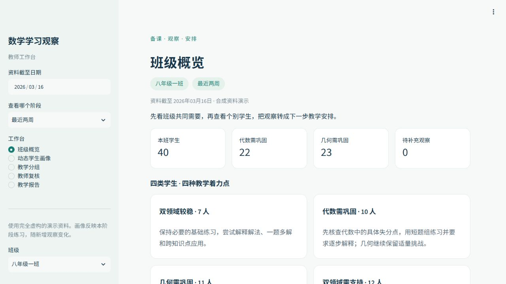
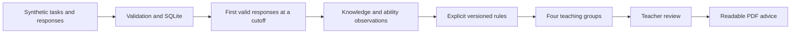

# Student Learning Analytics & Intervention Decision Support

**An explainable, teacher-facing mathematics learning analytics prototype built with Python, SQLite, Streamlit and Plotly.**

[中文说明](README.zh-CN.md) · [Methods](docs/methods.md) · [Evaluation](docs/evaluation.md) · [Demo walkthrough](docs/demo.md) · [Sample teacher report](examples/teacher-report.pdf)

Teachers need more than an overall score to decide what to teach next. This project turns assigned practice and first valid responses into changing knowledge profiles, separate ability observations, algebra–geometry teaching groups, and reviewable teaching suggestions.

**All students and responses are synthetic.** The system uses explicit rules, not a trained prediction model or an LLM. It requires no student records, API key or GPU. Engineering tests do not establish educational effectiveness.



## A quick tour

| Teacher question | Workspace feature |
|---|---|
| What needs attention in my class? | Class overview and knowledge-point observations |
| How is this student doing now? | Dynamic profile with knowledge, ability practice and comparable trends |
| Which teaching approach might fit? | Four algebra–geometry groups with typical situations and suggested actions |
| Does the suggestion match my classroom judgment? | Student, knowledge-domain and ability review tabs with preset choices |
| What should I take into the next lesson? | Readable class or individual PDF, separating confirmed and unconfirmed actions |

For a short review, start with the screenshot, the [sample PDF](examples/teacher-report.pdf), and [hand-calculated evaluation cases](docs/evaluation.md). The interface and teacher reports use Chinese; the technical documentation is in English.

## Run locally

Use Python 3.11 or newer and [uv](https://docs.astral.sh/uv/getting-started/installation/). Run from the repository root:

```bash
git clone https://github.com/wyou0410/student-learning-analytics-dss.git
cd student-learning-analytics-dss
uv sync --locked --extra dev
uv run learning-support demo
```

Open **http://127.0.0.1:8502**. The first run generates and validates synthetic CSV files, creates a new SQLite database, computes observations, produces a PDF and starts the dashboard. Later runs reuse the database and preserve reviews. If the port is occupied, append `--port 8503`.

```bash
# Prepare data and report without opening the dashboard
uv run learning-support demo --no-ui

# Recompute a particular observation period
uv run learning-support analyze --as-of 2026-03-16 --window-days 14

# Export the first class report
uv run learning-support report --class-id C1 --output output/pdf/class-report.pdf

# Execute calculation, time-boundary, persistence and UI checks
uv run pytest -q
```

Without uv, create a virtual environment, install `requirements.lock.txt` with pip, then install this project using `python -m pip install --no-deps -e .`. Run `python -m learning_support.v2_cli demo` from the repository root. Windows uses `python -m venv .venv` and `.venv\Scripts\python.exe`; macOS/Linux normally use `python3 -m venv .venv` and `.venv/bin/python`.

Dependency installation needs the internet; the application then works offline. The default observation date is **2026-03-16**, which matches the synthetic practice timeline. A date outside that timeline can correctly produce insufficient-evidence messages.

## How the decision support works



- **First valid attempt:** select the first scored response by attempt number, submission time and response ID. Unscored responses remain missing; a later retry cannot replace an earlier valid score.
- **Assigned-task denominator:** task completion is measured against eligible, assigned, due tasks, including assigned tasks with no submission.
- **Missing is not zero:** empty observations do not become zero scores. Domain judgments need at least five scored responses from two distinct tasks.
- **Two domains, four groups:** foundation practice in algebra and geometry determines the group. The demonstration threshold is 70%; insufficient evidence stays outside the four groups.
- **Abilities are separate:** computation, reasoning and application use explicitly tagged ability-probe questions. They are not inferred from overall scores and do not determine the group.
- **Comparable trends:** compare equal-length windows with the same knowledge point, difficulty and question-composition group, using fixed equal weights across shared strata. Otherwise, show that comparison is unavailable.
- **Traceable advice:** snapshots retain selected responses, task assignments, input hashes and rule/configuration versions. Reviews belong to a specific snapshot and are not silently inherited by another observation period.

| Algebra | Geometry | Suggested teaching emphasis |
|---|---|---|
| Steady | Steady | Explanation, variations and transfer; still inspect local gaps |
| Needs consolidation | Steady | Algebra concepts and transformation steps; maintain geometry challenges |
| Steady | Needs consolidation | Diagram conditions, properties and staged reasoning |
| Needs consolidation | Needs consolidation | One concrete priority per domain, short practice and feedback |

These are temporary observations, not fixed student types. The 70% threshold and suggested actions are author-defined demo rules requiring professional review.

## Data and verification

The default seed-42 dataset contains **80 synthetic students, 10 foundation knowledge points, 42 questions, 36 tasks, 2,880 assignments and 33,298 response rows** including retries and missing scores.

Algebra covers rational numbers, expressions, linear equations and inequalities. Geometry covers parallel lines and angles, triangles, congruence, isosceles triangles, Pythagoras and quadrilaterals. There are 30 foundation questions and 12 separate ability probes, each with a prompt, reference answer and versioned tag. This is a toy item bank, not a complete or calibrated curriculum.

The public test suite passed **36 tests** in a fresh local Windows environment. It covers hand-calculated groups, missingness, task denominators, first attempts, incomparable trends, future-data isolation, immutable snapshots, review persistence, teacher pages and PDF student coverage. The [evaluation note](docs/evaluation.md) records actual results and separates automated checks from pending professional review. GitHub Actions runs tests and a headless demo on Windows and Ubuntu; its live result is available in the repository's **Actions** tab.

## Repository guide

```text
app/main.py                 Teacher dashboard
src/learning_support/       Generation, validation, SQL metrics, rules, reviews and PDF
schemas/schema.sql          Constraints, provenance snapshots and review storage
queries/                    First-response and aggregation SQL
configs/                    Synthetic parameters and versioned demo thresholds
tests/                      Hand fixtures, boundary checks and Streamlit AppTest
docs/                       Methods, evaluation, contribution disclosure and walkthrough
examples/teacher-report.pdf One readable synthetic class report
.github/workflows/ci.yml     Reproducible checks
```

Generated CSV files, databases, run snapshots, test logs, caches, private settings and earlier dashboard versions are excluded. Shared calculation modules remain because they implement the audited SQL/rule contracts and regression tests.

## Limitations and project contribution

This prototype demonstrates **transparent rule-based decision support, evidence provenance and human oversight**, rather than machine-learning prediction. There is no measured accuracy, student-grade improvement, school trial or intervention-effect estimate. Repeated synthetic question sets may have memory effects in real use; difficulty is not calibrated. It is a local, single-teacher demo without production access control.

The repository owner defined the problem, requirements and teacher-facing revisions. Implementation, tests and documentation were developed with **OpenAI Codex assistance**. [Contribution disclosure](docs/contributions.md) states what is evidenced and what still needs owner/professional review. The project does not claim City University of Hong Kong endorsement, institutional deployment or independently authored implementation.

Next work is professional review of questions and teaching rules, followed by teacher usability feedback. Real-data use would require a separate scope, permissions and privacy design.

## Contributing and support

See [CONTRIBUTING](CONTRIBUTING.md), [community expectations](CODE_OF_CONDUCT.md) and [security reporting](SECURITY.md). Issues should include reproducible synthetic examples; never submit real student information. The project is maintained by [wyou0410](https://github.com/wyou0410).

**Rights:** public portfolio display with all rights reserved; this is not an MIT/Apache-licensed project. See [LICENSE](LICENSE). Third-party dependencies retain their own licenses.
